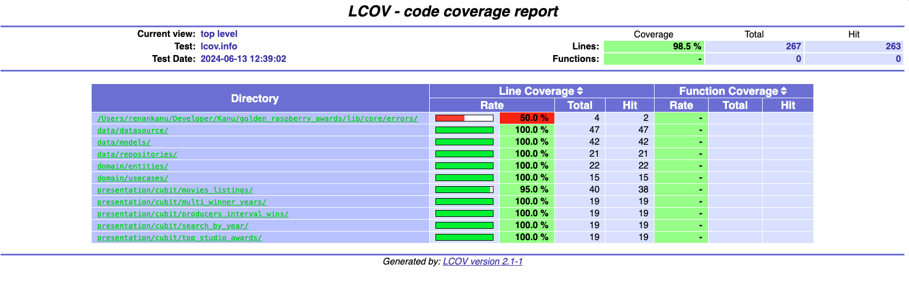

[](https://www.linkedin.com/in/renansantosbr/)

# Golden Raspberry Awards

## Descrição

Golden Raspberry Awards é um APP que lista os indicados e vencedores da categoria **Pior Filme**. App é um teste para a[ TEXO IT](https://www.texoit.com)

## Requisitos Funcionais

- [x] Mostrar em uma tabela os anos que tiveram mais de um vencedor;
- [x] Mostrar em uma tabela os três estúdios com mais vitórias;
- [x] Mostrar em tabelas os produtores com maior e menor intervalo entre vitórias;
- [x] Exibir em tabela os vencedores de determinado ano selecionado através de um campo de busca;
- [x] Listar filmes com paginação;
- [x] Filtrar por ano;
- [x] Filtrar por vencedor;

## Arquitetura

O projeto foi desenvolvido utilizando a Clean Architecture, que é uma arquitetura de software que visa separar as responsabilidades do projeto em camadas, facilitando a manutenção e a evolução do projeto.

## UI Design

O design foi adaptado para o mobile, para facilitar a visualização e a navegação do usuário. Está diferente do design original solicitado, mas foi feito para melhorar a experiência do usuário.

<div align="center">
    
    
    
    
</div>

## Tecnologias e Dependências

- [Flutter](https://flutter.dev/)
- [Dio](https://pub.dev/packages/dio)
- [Equatable](https://pub.dev/packages/equatable)
- [Flutter Bloc](https://pub.dev/packages/flutter_bloc)
- [Fpdart](https://pub.dev/packages/fpdart)
- [GetIt](https://pub.dev/packages/get_it)

Para os testes:

- [Bloc Test](https://pub.dev/packages/bloc_test)
- [Mockito](https://pub.dev/packages/mockito)

Para a instalação das dependências, basta rodar o comando:

```bash
flutter pub get
```

## Estrutura de Pastas

Seguindo a Clean Architecture, a estrutura de pastas foi organizada da seguinte forma, onde cada camada tem sua responsabilidade. Os testes unitários estão na mesma estrutura de pastas, porém dentro da pasta `test`.

```
lib
├── core
│   ├── components
│   ├── constants
│   ├── errors
│   ├── extensions
│   └── theme
├── features
│   ├── movies
│   │   ├── data
│   │   │   ├── datasources
│   │   │   ├── models
│   │   │   └── repositories
│   │   ├── domain
│   │   │   ├── entities
│   │   │   ├── repositories
│   │   │   └── usecases
│   │   ├── presentation
│   │   │   ├── cubit
│   │   │   ├── views
│   │   │   └── widgets

```

## Testes

Para rodar os testes, basta rodar o comando:

```bash
flutter test
```


Para rodar o teste com coverage e abrir o relatório no navegador, basta rodar o comando:

```bash
make run_cov
```


